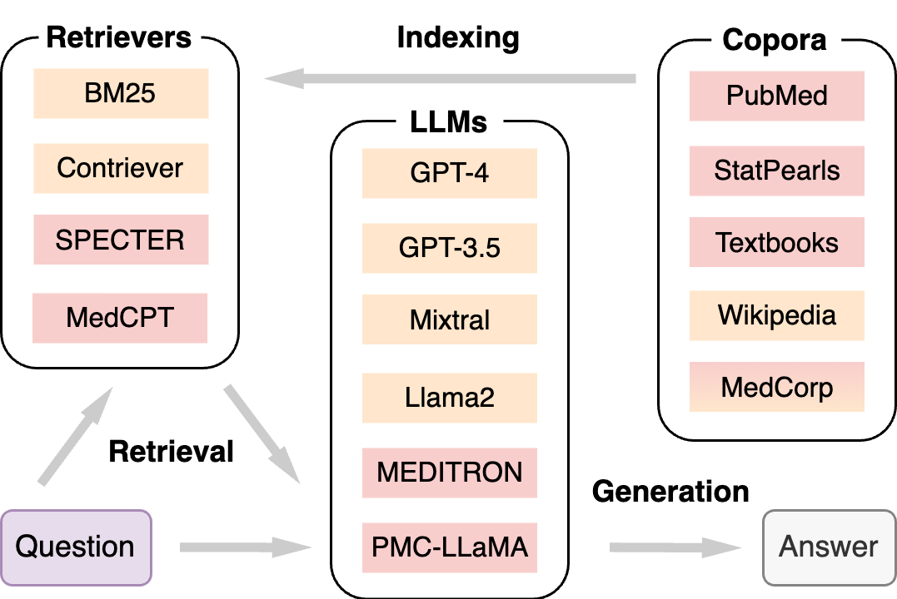

# MedRAG Toolkit

`MedRAG` a systematic toolkit for Retrieval-Augmented Generation (RAG) on medical question answering (QA). `MedRAG` is used to implement various RAG systems for the benchmark study on our [`MIRAGE`](https://github.com/Teddy-XiongGZ/MIRAGE) (Medical Information Retrieval-Augmented Generation Evaluation).

[](https://aclanthology.org/2024.findings-acl.372/)
[](https://teddy-xionggz.github.io/benchmark-medical-rag/)
[](https://huggingface.co/MedRAG)

## News
- (02/20/2025) [`RAG-Gym`](https://rag-gym.github.io/) is released! RAG-Gym is a unified framework for optimizing agentic RAG with process supervision, applicable to both general and medical QA tasks.
- (10/10/2024) Multiple updates!
- - We have changed the output format of open-source LLMs to make it similar to closed-source ones like GPT-4. Input tokens will no longer be included in the model output.
- - We updated our `transformers` version in requirements.txt to ensure [compatibility](#compatibility) with new LLMs, such as Llama 3.1 and 3.2.
- - Information retrieval in MedRAG can be accelerated by setting `corpus_cache=True` when initializing a `MedRAG` object.
- - Information retrieval for dense retrievers can be further accelerated by setting `HNSW=True` when initializing a `MedRAG` object for the first time (i.e., the faiss index hasn't been built).
- - Pre-computed embeddings of `Contriever`/`MedCPT`/`SPECTER` on `PubMed`/`Textbooks`/`Wikipedia` will be now be automatically downloaded when initializing a `MedRAG` object for the first time. No need to embed them on your machine! (We do not provide the embeddings of `StatPearls` due to frequent updates by the article [source](https://ftp.ncbi.nlm.nih.gov/pub/litarch/3d/12/))
- - The implementation of [`i-MedRAG` ](https://arxiv.org/abs/2408.00727) (to appear in PSB 2025) has been included. You can easily run it by setting `rag=True` and `follow_up=True` when initializing a `MedRAG` object. Demo code can be found in [Usage](#i-medrag-medrag-with-follow-up-queries).
- (06/19/2024) Add supports for openai>=1.0.0. MedRAG now allows pre-determined snippets/snippet ids as input.
- (05/16/2024) Our [paper](https://aclanthology.org/2024.findings-acl.372/) has been accepted by ACL 2024 Findings!
- (04/26/2024) Add supports for `Google/gemini-1.0-pro` and `meta-llama/Meta-Llama-3-70B-Instruct`.
- (02/26/2024) The code has been updated. It supports all corpora and retrievers introduced in our paper now.

## Table of Contents

- [Introduction](#introduction)
- - [Corpus](#corpus)
- - [Retriever](#retriever)
- - [LLM](#llm)
- [Requirements](#requirements)
- [Usage](#usage)
- [Compatibility](#compatibility)
- [Citation](#citation)

## Introduction

The following figure shows that MedRAG consists of three major components: Corpora, Retrievers, and LLMs.



### Corpus

For corpora used in MedRAG, we collect raw data from four different sources, including the commonly used [PubMed](https://pubmed.ncbi.nlm.nih.gov/) for all biomedical abstracts, [StatPearls](https://www.statpearls.com/) for clinical decision support, medical [Textbooks](https://github.com/jind11/MedQA) for domain-specific knowledge, and [Wikipedia](https://huggingface.co/datasets/wikipedia) for general knowledge. We also provide a MedCorp corpus by combining all four corpora, facilitating cross-source retrieval. Each corpus is chunked into short snippets.

| **Corpus**  | **#Doc.** | **#Snippets** | **Avg. L** | **Domain** |
|-------------|-----------|---------------|------------|------------|
| PubMed      | 23.9M     | 23.9M         | 296        | Biomed.    |
| StatPearls  | 9.3k      | 301.2k        | 119        | Clinics    |
| Textbooks   | 18        | 125.8k        | 182        | Medicine   |
| Wikipedia   | 6.5M      | 29.9M         | 162        | General    |
| MedCorp     | 30.4M     | 54.2M         | 221        | Mixed      |

(\#Doc.: numbers of raw documents; \#Snippets: numbers of snippets (chunks); Avg. L: average length of snippets.)

### Retriever

For the retrieval algorithms, we only select some representative ones in MedRAG, including a lexical retriever ([BM25](https://github.com/castorini/pyserini)), a general-domain semantic retriever ([Contriever](https://huggingface.co/facebook/contriever)), a scientific-domain retriever ([SPECTER](https://huggingface.co/allenai/specter)), and a biomedical-domain retriever ([MedCPT](https://huggingface.co/ncbi/MedCPT-Query-Encoder)).

| **Retriever** | **Type**   | **Size** | **Metric** | **Domain**   |
|---------------|------------|----------|------------|--------------|
| BM25          | Lexical    | --       | BM25       | General      |
| Contriever    | Semantic   | 110M     | IP         | General      |
| SPECTER       | Semantic   | 110M     | L2         | Scientific   |
| MedCPT        | Semantic   | 109M     | IP         | Biomed.      |

(IP: inner product; L2: L2 norm)

### LLM

We select several frequently used LLMs in MedRAG, including the commercial [GPT-3.5](https://platform.openai.com/) and [GPT-4](https://oai.azure.com/), the open-source [Mixtral](https://huggingface.co/mistralai/Mixtral-8x7B-Instruct-v0.1) and [Llama2](https://huggingface.co/meta-llama/Llama-2-70b-chat-hf), and the biomedical domain-specific [MEDITRON](https://huggingface.co/epfl-llm/meditron-70b) and [PMC-LLaMA](https://huggingface.co/axiong/PMC_LLaMA_13B).
Temperatures are set to 0 for deterministic outputs.

| **LLM**      | **Size** | **Context** | **Open** | **Domain** |
|--------------|----------|-------------|----------|------------|
| GPT-4        | N/A      | 32,768      | No       | General    |
| GPT-3.5      | N/A      | 16,384      | No       | General    |
| Mixtral      | 8×7B     | 32,768      | Yes      | General    |
| Llama2       | 70B      | 4,096       | Yes      | General    |
| MEDITRON     | 70B      | 4,096       | Yes      | Biomed.    |
| PMC-LLaMA    | 13B      | 2,048       | Yes      | Biomed.    |

(Context: context length of the LLM; Open: Open-source.)

## Requirements

- First, install PyTorch suitable for your system's CUDA version by following the [official instructions](https://pytorch.org/get-started/locally/) (2.1.1+cu121 in our case).
- - New LLMs such as Llama 3.1 and Llama 3.2 were tested with '2.4.1+cu124' on our machine.

- Then, install the remaining requirements using: `pip install -r requirements.txt`,

- For GPT-3.5/GPT-4, an OpenAI API key is needed. Replace the placeholder with your key in `src/config.py`.

- `Git-lfs` is required to download and load corpora for the first time.

- `Java` is requried for using BM25.

## Usage

Example medical qusetion from [MMLU](https://github.com/hendrycks/test)
```python
from src.medrag import MedRAG

question = "A lesion causing compression of the facial nerve at the stylomastoid foramen will cause ipsilateral"
options = {
    "A": "paralysis of the facial muscles.",
    "B": "paralysis of the facial muscles and loss of taste.",
    "C": "paralysis of the facial muscles, loss of taste and lacrimation.",
    "D": "paralysis of the facial muscles, loss of taste, lacrimation and decreased salivation."
}
```
#### CoT
```python
cot = MedRAG(llm_name="OpenAI/gpt-3.5-turbo-16k", rag=False)
answer, _, _ = cot.answer(question=question, options=options)
print(f"Final answer in json with rationale: {answer}")
# {
#   "step_by_step_thinking": "Compression of the facial nerve at the stylomastoid foramen will affect the function of the facial nerve. The facial nerve is responsible for innervating the muscles of facial expression, including those involved in smiling, frowning, and closing the eyes. It also carries taste sensation from the anterior two-thirds of the tongue. Additionally, the facial nerve controls tear production (lacrimation) and salivation. Therefore, compression of the facial nerve at the stylomastoid foramen will cause paralysis of the facial muscles (A), loss of taste (B), lacrimation (C), and decreased salivation (D).", 
#   "answer_choice": "D"
# }
```

#### MedRAG
```python
medrag = MedRAG(llm_name="OpenAI/gpt-3.5-turbo-16k", rag=True, retriever_name="MedCPT", corpus_name="Textbooks")
answer, snippets, scores = medrag.answer(question=question, options=options, k=32) # scores are given by the retrieval system
print(f"Final answer in json with rationale: {answer}")
# {
#   "step_by_step_thinking": "A lesion causing compression of the facial nerve at the stylomastoid foramen will result in paralysis of the facial muscles. Loss of taste, lacrimation, and decreased salivation are not specifically mentioned in relation to a lesion at the stylomastoid foramen.", 
#   "answer_choice": "A"
# }

### MedRAG with pre-determined snippets
snippets = [{'id': 'InternalMed_Harrison_30037', 'title': 'InternalMed_Harrison', 'content': 'On side of lesion Horizontal and vertical nystagmus, vertigo, nausea, vomiting, oscillopsia: Vestibular nerve or nucleus Facial paralysis: Seventh nerve Paralysis of conjugate gaze to side of lesion: Center for conjugate lateral gaze Deafness, tinnitus: Auditory nerve or cochlear nucleus Ataxia: Middle cerebellar peduncle and cerebellar hemisphere Impaired sensation over face: Descending tract and nucleus fifth nerve On side opposite lesion Impaired pain and thermal sense over one-half the body (may include face): Spinothalamic tract Although atheromatous disease rarely narrows the second and third segments of the vertebral artery, this region is subject to dissection, fibromuscular dysplasia, and, rarely, encroachment by osteophytic spurs within the vertebral foramina.', 'contents': 'InternalMed_Harrison. On side of lesion Horizontal and vertical nystagmus, vertigo, nausea, vomiting, oscillopsia: Vestibular nerve or nucleus Facial paralysis: Seventh nerve Paralysis of conjugate gaze to side of lesion: Center for conjugate lateral gaze Deafness, tinnitus: Auditory nerve or cochlear nucleus Ataxia: Middle cerebellar peduncle and cerebellar hemisphere Impaired sensation over face: Descending tract and nucleus fifth nerve On side opposite lesion Impaired pain and thermal sense over one-half the body (may include face): Spinothalamic tract Although atheromatous disease rarely narrows the second and third segments of the vertebral artery, this region is subject to dissection, fibromuscular dysplasia, and, rarely, encroachment by osteophytic spurs within the vertebral foramina.'}]
answer, _, _ = medrag.answer(question=question, options=options, snippets=snippets)

### MedRAG with pre-determined snippet ids
snippets_ids = [{"id": s["id"]} for s in snippets]
answer, snippets, _ = medrag.answer(question=question, options=options, snippets_ids=snippets_ids)
```

#### MedRAG with the corpus cached in memory (for fast information retrieval)
```python
medrag = MedRAG(llm_name="OpenAI/gpt-3.5-turbo-16k", rag=True, retriever_name="MedCPT", corpus_name="Textbooks", corpus_cache=True)
answer, snippets, scores = medrag.answer(question=question, options=options, k=32) # scores are given by the retrieval system
print(f"Final answer in json with rationale: {answer}")
# {
#   "step_by_step_thinking": "A lesion causing compression of the facial nerve at the stylomastoid foramen will result in paralysis of the facial muscles. Loss of taste, lacrimation, and decreased salivation are not specifically mentioned in relation to a lesion at the stylomastoid foramen.", 
#   "answer_choice": "A"
# }
```

#### i-MedRAG (MedRAG with follow-up queries)
```python
medrag = MedRAG(llm_name="OpenAI/gpt-3.5-turbo-16k", rag=True, follow_up=True, retriever_name="MedCPT", corpus_name="Textbooks", corpus_cache=True)
answer, history = medrag.answer(question=question, options=options, k=32, n_rounds=4, n_queries=3)
print(f"Final answer in json: {answer}") # {'answer': 'A'}
print(f"Raw answer with analysis: {history[-3]}")
# {
#   'role': 'assistant', 
#   'content': '## Analysis:\nBased on the previous information provided, a lesion causing compression of the facial nerve at the stylomastoid foramen can result in an ipsilateral loss of motor function of the whole side of the face. This can lead to an unusual appearance and complications with chewing food. Lacrimation and taste may not be affected if the lesion remains distal to the greater petrosal and chorda tympani branches that originate deep in the temporal bone. However, decreased salivation can occur if the lesion affects the parasympathetic fibers that innervate the salivary glands.\n\n## Answer:\nThe correct answer is A. paralysis of the facial muscles.'
# }
print(f"Follow-up queries generated: {[item.split('Answer: ')[0].strip() for item in history[-4]['content'].split('Query: ')[1:]]}")
# [
#   'What are the functions of the facial nerve?', 
#   'What is the anatomical location and function of the stylomastoid foramen?', 
#   'What are the possible effects of a lesion causing compression of the facial nerve at the stylomastoid foramen?', 
#   'What are the specific branches of the facial nerve that control taste sensation and lacrimation?', 
#   'How does a lesion at the stylomastoid foramen affect salivation?', 
#   'Are there any other possible effects of a lesion causing compression of the facial nerve at the stylomastoid foramen?', 
#   'What are the effects of a lesion causing compression of the facial nerve at the stylomastoid foramen on salivation?', 
#   'Can a lesion at the stylomastoid foramen affect lacrimation and taste if it remains distal to the greater petrosal and chorda tympani branches?', 
#   'Are there any other possible effects of a lesion causing compression of the facial nerve at the stylomastoid foramen?', 
#   'What is the specific effect of a lesion causing compression of the facial nerve at the stylomastoid foramen on lacrimation?', 
#   'How does a lesion at the stylomastoid foramen affect taste sensation?', 
#   'Can a lesion at the stylomastoid foramen result in decreased salivation?'
# ]
```

## Compatibility
We've [tested](https://teddy-xionggz.github.io/MIRAGE/) the following LLMs on our MedRAG toolkit:
- OpenAI/gpt-4
- OpenAI/gpt-3.5-turbo
- Google/gemini-1.0-pro
- meta-llama/Meta-Llama-3-70B-Instruct
- meta-llama/Llama-2-70b-chat-hf
- mistralai/Mixtral-8x7B-Instruct-v0.1
- epfl-llm/meditron-70b
- axiong/PMC_LLaMA_13B

Other LLMs that can run but are not comprehensively evaluated by MedRAG:
- OpenAI/gpt-4o
- OpenAI/gpt-4o-mini
- meta-llama/Meta-Llama-3-8B-Instruct
- meta-llama/Meta-Llama-3.1-8B-Instruct
- meta-llama/Meta-Llama-3.1-70B-Instruct
- meta-llama/Llama-3.2-1B-Instruct
- meta-llama/Llama-3.2-3B-Instruct

## Citation
For the use of `MedRAG`, please consider citing
```bibtex
@inproceedings{xiong-etal-2024-benchmarking,
    title = "Benchmarking Retrieval-Augmented Generation for Medicine",
    author = "Xiong, Guangzhi  and
      Jin, Qiao  and
      Lu, Zhiyong  and
      Zhang, Aidong",
    editor = "Ku, Lun-Wei  and
      Martins, Andre  and
      Srikumar, Vivek",
    booktitle = "Findings of the Association for Computational Linguistics ACL 2024",
    month = aug,
    year = "2024",
    address = "Bangkok, Thailand and virtual meeting",
    publisher = "Association for Computational Linguistics",
    url = "https://aclanthology.org/2024.findings-acl.372",
    pages = "6233--6251",
    abstract = "While large language models (LLMs) have achieved state-of-the-art performance on a wide range of medical question answering (QA) tasks, they still face challenges with hallucinations and outdated knowledge. Retrieval-augmented generation (RAG) is a promising solution and has been widely adopted. However, a RAG system can involve multiple flexible components, and there is a lack of best practices regarding the optimal RAG setting for various medical purposes. To systematically evaluate such systems, we propose the Medical Information Retrieval-Augmented Generation Evaluation (MIRAGE), a first-of-its-kind benchmark including 7,663 questions from five medical QA datasets. Using MIRAGE, we conducted large-scale experiments with over 1.8 trillion prompt tokens on 41 combinations of different corpora, retrievers, and backbone LLMs through the MedRAG toolkit introduced in this work. Overall, MedRAG improves the accuracy of six different LLMs by up to 18{\%} over chain-of-thought prompting, elevating the performance of GPT-3.5 and Mixtral to GPT-4-level. Our results show that the combination of various medical corpora and retrievers achieves the best performance. In addition, we discovered a log-linear scaling property and the {``}lost-in-the-middle{''} effects in medical RAG. We believe our comprehensive evaluations can serve as practical guidelines for implementing RAG systems for medicine.",
}
```

For the use of `i-MedRAG`, please consider citing
```bibtex
@inproceedings{xiong2024improving,
  title={Improving retrieval-augmented generation in medicine with iterative follow-up questions},
  author={Xiong, Guangzhi and Jin, Qiao and Wang, Xiao and Zhang, Minjia and Lu, Zhiyong and Zhang, Aidong},
  booktitle={Biocomputing 2025: Proceedings of the Pacific Symposium},
  pages={199--214},
  year={2024},
  organization={World Scientific}
}
```
